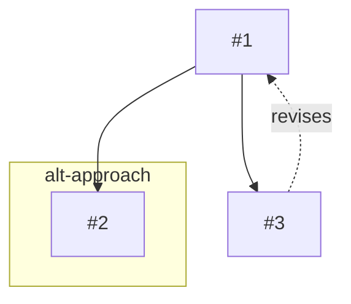

**The most advanced sequential reasoning MCP for autonomous AI workflows.** Enables structured problem-solving with parallel exploration, branch navigation, and persistent thought chains that survive context window compaction.

Built by a developer working *with* AI to solve real autonomous reasoning challenges. Extends dormant branching capabilities in Anthropic's original sequential-thinking server.

## Why we created MAXential Thinking

**Reasoning is Ephemeral:** AI model, LLM, reasoning is ephemeral. When context windows fill up, thinking gets compressed or is lost. Complex problems and brainstorming need exploration of multiple ideas and approaches. We wanted a way to optimize AI's abilities by having them think in parallel, with multisteps, backtracking when needed, and to summarize their findings.

**Branching Chains:** While designing MAXential Thinking to enable reasoning through multiple thought-chains, we looked to Anthropic's sequential-thinking server for inspiration. We discovered it had *branching capabilities in its schema but no tools to access them*. So we forked it and expanded their dormant branching with 11 tools that allow AI to actively reason.

**Reasoning in AI models and LLMs is ephemeral. When context windows fill up, thinking gets compressed or is lost. Complex problems and brainstorming need exploration of multiple ideas and approaches. We wanted a way to optimize AI reasoning by enabling parallel exploration, with multi-steps, backtracking when needed, and to summarise their findings.
**Branching Chains:** While designing MAXential Thinking to enable reasoning through multiple thought-chains, we looked to Anthropic's sequential-thinking server for inspiration. We discovered it had *branching capabilities in its schema but no tools to access them*. So we forked it and expanded their dormant branching with 11 tools that allow AI to actively reason.
## For AI Assistants (Claude, ChatGPT, etc.)
Using this MCP server instead of Sequential Thinking MCP, you gain:

### **Structured Reasoning That Persists**
- Thought chains survive context window compaction
- Navigate back to earlier reasoning without losing context
- Revise earlier thoughts as understanding evolves
- Export complete reasoning chains for handoff or documentation

### **Parallel Exploration**
- Branch to explore different approaches/ideas/thoughts simultaneously
- Compare solutions/outcomes side-by-side before choosing
- Merge insights back to main reasoning thread
- Close branches that come up empty without impacting main thread

### **Autonomous Workflow Enhancement**
- Tag thoughts for semantic organization (hypothesis, evidence, decision, finding)
- Search your reasoning history by content or tags
- Generate diagrams of your thought process (Mermaid/ASCII)
- Build complex solutions with transparent reasoning

## What Makes This Different

**Original sequential-thinking:** 1 tool with 9 parameters. Branch parameters existed but no way to use them.

**MAXential Thinking v2.0:** 11 focused tools that match reasoning patterns:
- No parameter juggling - simply call the right tool
- Branching works - explore, switch, merge, close
  
AI models benefit from structured thinking. This server externalizes that process, making it:
- **Transparent** - See the reasoning chain, not just conclusions
- **Navigable** - Branch to explore alternatives, backtrack, revise
- **Searchable** - Find thoughts by content or tags
- **Exportable** - Share reasoning as markdown or JSON

## Features

### Core Thinking (v2.0)
| Tool | Description |
|------|-------------|
| `think` | Add a thought to your reasoning chain |
| `revise` | Revise a previous thought |
| `complete` | Mark thinking chain complete with conclusion |

### Branching (v2.0)
| Tool | Description |
|------|-------------|
| `branch` | Create a new reasoning branch (like git) |
| `switch_branch` | Switch between branches (use "main" to return) |
| `list_branches` | List all branches with status |
| `get_branch` | Get details of a specific branch |
| `close_branch` | Close a branch with optional conclusion |
| `merge_branch` | Merge insights back to main |

### Navigation (v2.0)
| Tool | Description |
|------|-------------|
| `get_thought` | Retrieve a specific thought by number |
| `get_history` | Get thought history, optionally filtered |

### Organization (v2.2)
| Tool | Description |
|------|-------------|
| `reset` | Clear session, start fresh |
| `tag` | Add semantic tags to thoughts (hypothesis, evidence, decision, etc.) |
| `search` | Find thoughts by content or tags |
| `export` | Export to markdown or JSON |
| `visualize` | Generate ASCII or Mermaid diagrams |

## Installation

### Claude Desktop

Add to your `claude_desktop_config.json`:

**macOS**: `~/Library/Application Support/Claude/claude_desktop_config.json`
**Windows**: `%APPDATA%\Claude\claude_desktop_config.json`

```json
{
  "mcpServers": {
    "maxential-thinking": {
      "command": "npx",
      "args": ["-y", "@bam-devcrew/maxential-thinking-mcp"]
    }
  }
}
```

### From Source

```bash
git clone https://github.com/BAM-DevCrew/MAXential-Thinking-MCP.git
cd MAXential-Thinking-MCP
npm install
npm run build
```

Then configure:
```json
{
  "mcpServers": {
    "maxential-thinking": {
      "command": "node",
      "args": ["/path/to/MAXential-Thinking-MCP/dist/src/index.js"]
    }
  }
}
```

## Usage Examples

### Basic Thinking
```
think: "The user wants to optimize database queries"
think: "First, I should check for N+1 query problems"
think: "Found 3 N+1 issues in the user service"
tag: thoughtNumber=3, add=["finding", "database"]
complete: "Fixed N+1 queries, reduced load time by 40%"
```

### Branching for Alternatives
```
think: "Should we use REST or GraphQL?"
branch: branchId="rest-approach", reason="Exploring REST"
think: "REST is simpler, better caching"
switch_branch: branchId="main"
branch: branchId="graphql-approach", reason="Exploring GraphQL"
think: "GraphQL reduces overfetching"
merge_branch: branchId="rest-approach", strategy="summary"
```

### Search and Export
```
search: query="database"           # Find by content
search: tags=["decision"]          # Find by tag
export: format="markdown"          # Get full chain as markdown
visualize: format="mermaid"        # Get diagram for docs
```

## Visualization Output

### Mermaid (for GitHub, Obsidian, etc.)


### ASCII
```
Thinking Chain
==============

T1 --> T2 --> T3
Branch [alt-approach] from T1

Revisions:
  T3 revises T1
```

## Logging

Enable file logging by setting environment variable:

```json
{
  "mcpServers": {
    "maxential-thinking": {
      "command": "node",
      "args": ["/path/to/dist/src/index.js"],
      "env": {
        "MAXENTIAL_LOG_FILE": "/path/to/error.log"
      }
    }
  }
}
```

## Development

```bash
npm install          # Install dependencies
npm run build        # Build TypeScript
npm run watch        # Watch mode for development
```

## License

MIT

## Contributing

Issues and PRs welcome at [github.com/BAM-DevCrew/MAXential-Thinking-MCP](https://github.com/BAM-DevCrew/MAXential-Thinking-MCP)

